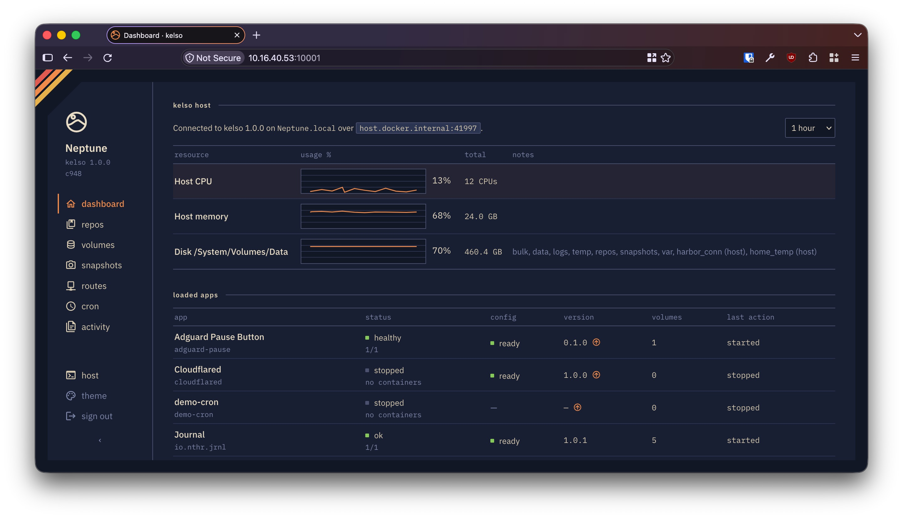
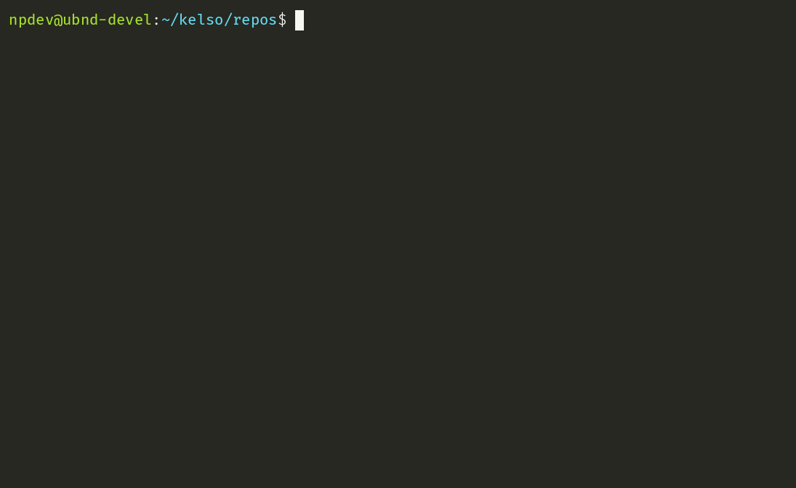

# Kelso Hosting Platform

**A declarative selfhosting platform for managing and distributing apps.**

Kelso is a self-hosting management system where apps are packages that describe *what* they need rather than *how* they get it. This, combined with a small amount of one time configuration allows for easy distribution, secrets, management, and snapshotting of self-hosted apps.



- **Configure your system layout once, load any app.** Kelso uses the system layout you specify along with each app's manifest to talior each app to your hardware.
- **No vendor lock-in by design.** Under the hood, each app is a docker compose project. If you erase `kelso` from your system, you'll still have an organized, functional folder tree of docker compose stacks that you can directly interact with. Try it!
- **Comprehensive snapshot and rollback** `kelso snapshot take <app>` stops the app, archives its volumes and run state together, and starts it again, so what you get back is a coherent point in time. If your app doesn't require 100% uptime 24/7, you can confidentaly snapshot your app in a frozen state.
- **LLMs can build and deploy apps in minutes** Kelso is uncomplicated and well documented. LLMs have no trouble reading the docs and creating deployment-ready, custom applications for you.

## How does it work?
Kelso provides an "infrastructure as code" platform with just enough abstraction for self hosting. Each app is packaged as a kelso app bundle that 1) defines a `manifest.toml` which fully describes the app's containers and what they need and 2) optionally contains any helper scripts or files. A bundle is either a `<app_id>.klso` folder or, for small apps, a single `<app_id>.klso.md` markdown file with the same files embedded in code blocks (see [demo-markdown](demo-apps/demo-markdown.klso.md)). Here's a simplified example:

unifi-network-application.klso/manifest.toml:
```toml
[app]
description = "Unifi Network Application from linuxserver.io"

[config]
# A secret that the user never has to set, generated on load and stored encrypted.
mongo_pass = { secret = true, default = "auto" }

[volumes]
db_data    = { kind = "data" }
app_config = { kind = "data" }

[run.unifi-db]
image   = "docker.io/mongo:8.0.11"
volumes = { db_data = "/data/db" }
env     = { MONGO_PASS = "${mongo_pass}", ... }

[run.main]
image   = "lscr.io/linuxserver/unifi-network-application:10.4.57"
volumes = { app_config = "/config" }
env     = { MONGO_HOST = "unifi-db", MONGO_PASS = "${mongo_pass}", ... }

[run.main.routes]
main = { port = "8443", scheme = "https" }
```

This describes everything that the Unifi Network Application needs to run on Kelso. You then bring it up with:
```
$ kelso load unifi-network-application
$ kelso start unifi-network-application
```



Under the hood, Kelso is using the manifest + your configuration to create a docker compose project.

Manifests are small enough to be digested in a few seconds. For a full, functioning example, see my [case study](docs/case_study.md) on the Unifi Network Application where we build the manifest from scratch in a few minutes.

## What Kelso provides

- **A web UI.** Host resources, loaded apps, volumes, snapshots, routes, cron and activity, served by the [kelso-ui](apps/kelso-ui.klso) app over kelsod's admin socket.
- **Secrets.** Declared in the manifest, generated on load, stored encrypted. No hidden `.env` files.
- **Volumes.** Each app specifies what class of storage it needs: normal data, bulk data, logs, and temp.
- **Snapshots.** Whole-app archives of volumes and run state, taken at a coherent point in time, restored the same way.
- **Cron.** Scheduled commands inside an app, run by kelsod.
- **Routes.** Expose an app's ports through Cloudflare Tunnel, Nginx Proxy Manager or Pangolin.
- **App repos.** A repo is a folder of bundles pushed to git. `kelso repo add` makes every app in it a `kelso start` away.

The full list of what a manifest can say is in the [manifest](docs/manifest.md) docs.

## Apps today

`kelso init` adds the [staples](apps) repo, the apps kelso maintains:

| App | |
| --- | --- |
| [kelso-ui](apps/kelso-ui.klso) | Web interface for kelso, over the kelsod admin socket |
| [immich](apps/immich.klso.md) | Self-hosted photo and video backup |
| [jellyfin](apps/jellyfin.klso.md) | Stream your own movies, shows and music to any device |
| [mealie](apps/mealie.klso.md) | Manage, save, share recipes and make shopping lists |
| [nginx-proxy-manager](apps/nginx-proxy-manager.klso.md) | Reverse proxy, w/ ssl certs managed by letsencrypt |
| [cloudflared](apps/cloudflared.klso.md) | Cloudflare Tunnel connector for the cloudflare_tunnel route provider |
| [unifi-network-application](apps/unifi-network-application.klso) | Unifi Network Application from linuxserver.io |
| [adguard-pause](apps/adguard-pause.klso) | A service that pauses adguard DNS blocking for a while via giant button |

The [demo apps](demo-apps) are small ones that each show off a feature, one readable file apiece. Writing your own takes a few minutes: see the [case study](docs/case_study.md).

## Getting Started
Kelso needs `git`, `docker` with the compose plugin, and `uv`, on Linux with your user in the `docker` group. Then:
```bash
uv tool install "git+https://github.com/nepthar/kelso@v1.0.1"
kelso init --yes
sudo reboot
```
`init --yes` sets kelso up in `~/kelso`, fetches its repo of apps, and runs `kelsod` as a systemd user service. For the web UI, choose its admin password and start it; it prints the address to open:
```bash
kelso start kelso-ui --set admin_pass=<password>
```

The [install guide](docs/install.md) has the prerequisites for a fresh Ubuntu Server, why the reboot matters, a tour of the demo apps, and how to upgrade, uninstall, and move volumes onto other disks.

## Why kelso?

- **Configure your system layout once, load any app**
Kelso places each app's data where you tell it. Apps describe "what" they need instead of "how" it's wired up.

- **Distributing apps you run yourself is hard today.**
Kelso makes it trivial to create and use app repositories. It's just a folder pushed to github, and the apps in it run on any properly configured install of kelso.

- **Running apps with docker compose by hand is time consuming.**
Once you start using docker compose to run your own apps, you end up managing each compose file individually. It's difficult to version control a folder of them properly. Each new app (except for super simple ones) has to be hand-configured and wired in to your system, with its secrets in `.env` files and its data in docker volumes you can't easily see into. I also personally hate .env files and never want to deal with them. **Kelso provides a simple mechanism to store/inspect secrets, application data, and logs. You configure it once, it wires every app automatically.**

- **Other solutions exist, but require you to be a sysadmin.**
Kelso is simple to reason about. It is mostly just a bunch of folders and text files.

- **Snapshotting containers SHOULD be trivial in 2026, but is not.**
Since kelso is designed for a single machine you own, it assumes that a few seconds of downtime is an acceptable price for a snapshot you can actually trust. `kelso snapshot take <app>` stops the app, archives its volumes and run state together, and starts it again if it was running — so what you get back is a coherent point in time rather than a copy of files that were being written to. Restoring is the same trade in reverse.

There are GUI options like Portainer and Dockge that help manage containers and stacks, but they basically wrap the problems above in a shiny UI rather than solve them.

## Why NOT kelso?
You may not want to use kelso if:

- You regularly run complicated, redundant container deployments that failover, have more than ~25 concurrent users, or have serious compute requirements.

- You are self-hosting to learn how to use specific technologies like Kubernetes

## See Also

- [Installing kelso](docs/install.md): prerequisites, upgrading, uninstalling, volume locations
- The anatomy of a kelso app [manifest](docs/manifest.md)
- A [case study](docs/case_study.md): building one from scratch
- Our current [roadmap](docs/roadmap.md), with known issues and the todo list
- How the [test suite](docs/testing.md) is put together

## Contributing
Contributions are welcome under the Apache License 2.0; see [CONTRIBUTING.md](CONTRIBUTING.md) for the sign-off (DCO) and the checks to run before a PR.

## Why "Kelso"?
[Kelso](https://www.nps.gov/moja/learn/historyculture/kelso-depot.htm) was a small, unremarkable but important train stop in the Mojave desert. Like this app, it served a purpose with little to no fanfare.

## Philosophy & Bigger Picture
I want to enable more people to **run software like it's 1997**. Back in 1997, you bought a copy of Microsoft Word and MSFT had NO IDEA what crazy manifestos you were writing with it, because it was your copy running on hardware you controlled. You could pull the plug. You didn't lose access to your documents if you stopped paying a subscription. "I'm altering the deal, pray I don't alter it any further" was a fun line from Star Wars, not the *implication* of the latest "update" from Adobe Creative Cloud.
